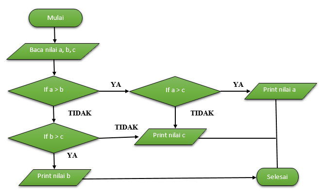

# labspy02
## Tugas Praktikum 2
### Program input tiga buah bilangan dan menentukan nilai terbesarnya
#### Algoritma Program 

#### Flowchart

#### Program

#### Output

## Latihan 1: Membuat program menentukan nilai akhir
### Program

### Output

## Latihan 2: Membuat program menampilkan status gaji karyawan
### Program

### Output

## Latihan 3: penggunaan kondisi OR
## program membandingkan 3 input bilangan, apabila penjumlahan 2 bilangan hasilnya sama dengan bilangan lainnya, maka cetak pernyataan “BENAR”
### Program

### Output

