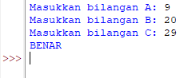

# labspy02
## Tugas Praktikum 2
### Program input tiga buah bilangan dan menentukan nilai terbesarnya
#### Algoritma menentukan nilai terbeasar dari 3 buah bilangan.
- Diketahui 3 buah bilangan Bil1, Bil2, Bil3 akan dicari nilai terbesar.

1. Mulai
2. Inisiasi Bil1, Bil2, Bil3 sebagai Integer
3. Baca Bil1
4. Baca Bil2
5. Baca Bil3
6. Jika Bil1 > Bil2 dan Bil1 > Bil3 maka kerjakan langkah nomor 8, selain itu.
7. Jika Bil2 > Bil1 dan Bil2 > Bil3 maka kerjakan langkah nomor 9, selain itu kerjakan langkah nomor 10
8. Cetak "Bilangan terbesar bilangan pertama"
9. Cetak "Bilangan terbesar bilangan kedua"
10. Cetak "Bilangan terbesar bilangan ketiga"
11. Selesai
#### Flowchart

#### Program
- Gunakan statement if untuk inisiasi Bilangan Pertama.
- Gunakan statement elif untuk inisiasi Bilangan Kedua.
- Gunakan statement else untuk inisiasi Bilangan Ketiga.
- Kemudian Run

#### Output

## Latihan 1: Membuat program menentukan nilai akhir
### Program

### Output

## Latihan 2: Membuat program menampilkan status gaji karyawan
### Program

### Output

## Latihan 3: penggunaan kondisi OR
## program membandingkan 3 input bilangan, apabila penjumlahan 2 bilangan hasilnya sama dengan bilangan lainnya, maka cetak pernyataan “BENAR”
### Program

### Output

